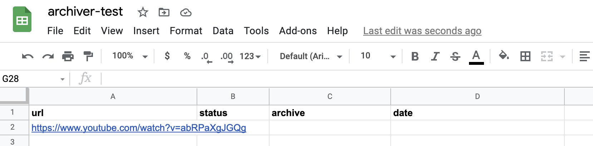
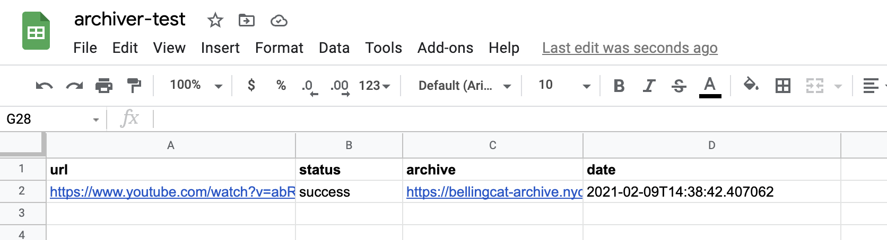

# auto-archiver

This Python script will look for links to Youtube, Twitter, etc,. in a specified column of a Google Sheet, uses YoutubeDL to download the media, stores the result in a Digital Ocean space, and updates the Google Sheet with the archive location, status, and date. It can be run manually or on an automated basis.

## Setup

If you are using `pipenv` (recommended), `pipenv install` is sufficient to install Python prerequisites.

[A Google Service account is necessary for use with `gspread`.](https://gspread.readthedocs.io/en/latest/oauth2.html#for-bots-using-service-account) Credentials for this account should be stored in `~/.config/gspread/service_account.json`.

A `.env` file is required for saving content to a Digital Ocean space. This file should contain the following variables:

```
DO_SPACES_REGION=
DO_BUCKET=
DO_SPACES_KEY=
DO_SPACES_SECRET=
```

## Running

There are several necessary command line flags:
* `--sheet name` sets the name of the Google Sheet to check for URLs. This sheet must have been shared with the Google Service account used by `gspread`.
* `--url-col`, `--status-col`, `--archive-col`, and `--date-col` give the letter name of the column for the original source URL, the archiver status, the archive location, and the archive date respectively.

For example, for use with this spreadsheet:



```pipenv run python auto-archive.py --sheet archiver-test --url-col A --status-col B --archive-col C --date-col D ```

The Youtube link is downloaded and archived, and the spreadsheet is updated to the following:



By default, the archiver will skip over live streaming content. However, with the `--streaming` flag, it will skip over non-real time content and archive livestreams. This is blocking, and each execution of the archiver will start downloading only a single livestreamed video. This is so that it can be used in combination with a non-streaming archiver, as detailed below.

Finally, by default only the first worksheet in a Google Sheet is checked. To check all use the `--all-worksheets` flag. These worksheets must use the same column locations.

## Automating

The auto-archiver can be run automatically via cron. To prevent overlapping execution (which should not affect archive integrity, but will use unecessary compute and network resources) `flock` can be used to create a lockfile. An example crontab entry that runs the archiver every minute is as follows.

```* * * * * flock -w 0 archive.lock python auto-archive.py --sheet archiver-test --url-col A --status-col B --archive-col C --date-col D```

Of course, additional logging information, etc. might be required.

With streaming mode enabled, the archiver can run safely at any frequency (since each iteration affects only a single row in the spreadsheet and it marks when streaming has started.) An example crontab line to run it every minute is as follows:

```* * * * * python auto-archive.py --sheet archiver-test --url-col A --status-col B --archive-col C --date-col D --streaming```

When these two cronjobs are used together, the archiver should archive and store all media added to the Google Sheet every 60 seconds.
