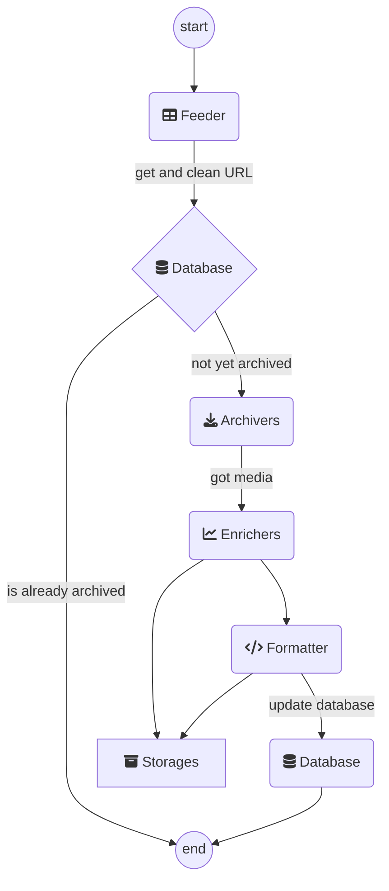

<h1 align="center">Auto Archiver</h1>

[](https://badge.fury.io/py/auto-archiver)
[](https://hub.docker.com/r/bellingcat/auto-archiver)
[](https://github.com/bellingcat/auto-archiver/actions/workflows/tests-core.yaml)
[](https://github.com/bellingcat/auto-archiver/actions/workflows/tests-download.yaml)
<!--  -->
<!-- [](https://pypi.python.org/pypi/auto-archiver/) -->
<!-- [](https://vk-url-scraper.readthedocs.io/en/latest/?badge=latest) -->


Read the [article about Auto Archiver on bellingcat.com](https://www.bellingcat.com/resources/2022/09/22/preserve-vital-online-content-with-bellingcats-auto-archiver-tool/).


Python tool to automatically archive social media posts, videos, and images from a Google Sheets, the console, and more. Uses different archivers depending on the platform, and can save content to local storage, S3 bucket (Digital Ocean Spaces, AWS, ...), and Google Drive. If using Google Sheets as the source for links, it will be updated with information about the archived content. It can be run manually or on an automated basis.


## Installation

For full instructions on how to install auto-archiver, view the [Installation Guide](installation/installation.md)

Quick run using docker:

`docker pull bellingcat/auto-archiver && docker run`


# Orchestration
The archiver work is orchestrated by the following workflow (we call each a **step**): 
1. **Feeder** gets the links (from a spreadsheet, from the console, ...)
2. **Archiver** tries to archive the link (twitter, youtube, ...)
3. **Enricher** adds more info to the content (hashes, thumbnails, ...)
4. **Formatter** creates a report from all the archived content (HTML, PDF, ...)
5. **Database** knows what's been archived and also stores the archive result (spreadsheet, CSV, or just the console)

To setup an auto-archiver instance create an `orchestration.yaml` which contains the workflow you would like. We advise you put this file into a `secrets/` folder and do not share it with others because it will contain passwords and other secrets. 

The structure of orchestration file is split into 2 parts: `steps` (what **steps** to use) and `configurations` (how those steps should behave), here's a simplification:
```yaml
# orchestration.yaml content
steps:
  feeder: gsheet_feeder
  archivers: # order matters
    - youtubedl_archiver
  enrichers:
    - thumbnail_enricher
  formatter: html_formatter
  storages:
    - local_storage
  databases:
    - gsheet_db

configurations:
  gsheet_feeder:
    sheet: "your google sheet name"
    header: 2 # row with header for your sheet
  # ... configurations for the other steps here ...
```

To see all available `steps` (which archivers, storages, databases, ...) exist check the [example.orchestration.yaml](example.orchestration.yaml).

All the `configurations` in the `orchestration.yaml` file (you can name it differently but need to pass it in the `--config FILENAME` argument) can be seen in the console by using the `--help` flag. They can also be overwritten, for example if you are using the `cli_feeder` to archive from the command line and want to provide the URLs you should do:

```bash
auto-archiver --config secrets/orchestration.yaml --cli_feeder.urls="url1,url2,url3"
```

Here's the complete workflow that the auto-archiver goes through:



## Orchestration checklist
Use this to make sure you help making sure you did all the required steps:
* [ ] you have a `/secrets` folder with all your configuration files including
  * [ ] a orchestration file eg: `orchestration.yaml` pointing to the correct location of other files
  * [ ] (optional if you use GoogleSheets) you have a `service_account.json` (see [how-to](https://gspread.readthedocs.io/en/latest/oauth2.html#for-bots-using-service-account))
  * [ ] (optional for telegram) a `anon.session` which appears after the 1st run where you login to telegram
    * if you use private channels you need to add `channel_invites` and set `join_channels=true` at least once
  * [ ] (optional for VK) a `vk_config.v2.json`
  * [ ] (optional for using GoogleDrive storage) `gd-token.json` (see [help script](scripts/create_update_gdrive_oauth_token.py))
  * [ ] (optional for instagram) `instaloader.session` file which appears after the 1st run and login in instagram
  * [ ] (optional for browsertrix) `profile.tar.gz` file

#### Example invocations
The recommended way to run the auto-archiver is through Docker. The invocations below will run the auto-archiver Docker image using a configuration file that you have specified

```bash
# all the configurations come from ./secrets/orchestration.yaml
docker run --rm -v $PWD/secrets:/app/secrets -v $PWD/local_archive:/app/local_archive bellingcat/auto-archiver --config secrets/orchestration.yaml
# uses the same configurations but for another google docs sheet 
# with a header on row 2 and with some different column names
# notice that columns is a dictionary so you need to pass it as JSON and it will override only the values provided
docker run --rm -v $PWD/secrets:/app/secrets -v $PWD/local_archive:/app/local_archive bellingcat/auto-archiver --config secrets/orchestration.yaml --gsheet_feeder.sheet="use it on another sheets doc" --gsheet_feeder.header=2 --gsheet_feeder.columns='{"url": "link"}'
# all the configurations come from orchestration.yaml and specifies that s3 files should be private
docker run --rm -v $PWD/secrets:/app/secrets -v $PWD/local_archive:/app/local_archive bellingcat/auto-archiver --config secrets/orchestration.yaml --s3_storage.private=1
```

The auto-archiver can also be run locally, if pre-requisites are correctly configured. Equivalent invocations are below.

```bash
# all the configurations come from ./secrets/orchestration.yaml
auto-archiver --config secrets/orchestration.yaml
# uses the same configurations but for another google docs sheet 
# with a header on row 2 and with some different column names
# notice that columns is a dictionary so you need to pass it as JSON and it will override only the values provided
auto-archiver --config secrets/orchestration.yaml --gsheet_feeder.sheet="use it on another sheets doc" --gsheet_feeder.header=2 --gsheet_feeder.columns='{"url": "link"}'
# all the configurations come from orchestration.yaml and specifies that s3 files should be private
auto-archiver --config secrets/orchestration.yaml --s3_storage.private=1
```

### Extra notes on configuration
#### Google Drive
To use Google Drive storage you need the id of the shared folder in the `config.yaml` file which must be shared with the service account eg `autoarchiverservice@auto-archiver-111111.iam.gserviceaccount.com` and then you can use `--storage=gd`

#### Telethon + Instagram with telegram bot
The first time you run, you will be prompted to do a authentication with the phone number associated, alternatively you can put your `anon.session` in the root.

#### Atlos
When integrating with [Atlos](https://atlos.org), you will need to provide an API token in your configuration. You can learn more about Atlos and how to get an API token [here](https://docs.atlos.org/technical/api). You will have to provide this token to the `atlos_feeder`, `atlos_storage`, and `atlos_db` steps in your orchestration file. If you use a custom or self-hosted Atlos instance, you can also specify the `atlos_url` option to point to your custom instance's URL. For example:

```yaml
# orchestration.yaml content
steps:
  feeder: atlos_feeder
  archivers: # order matters
    - youtubedl_archiver
  enrichers:
    - thumbnail_enricher
    - hash_enricher
  formatter: html_formatter
  storages:
    - atlos_storage
  databases:
    - console_db
    - atlos_db

configurations:
  atlos_feeder:
    atlos_url: "https://platform.atlos.org" # optional
    api_token: "...your API token..."
  atlos_db:
    atlos_url: "https://platform.atlos.org" # optional
    api_token: "...your API token..."
  atlos_storage:
    atlos_url: "https://platform.atlos.org" # optional
    api_token: "...your API token..."
  hash_enricher:
    algorithm: "SHA-256"
```

