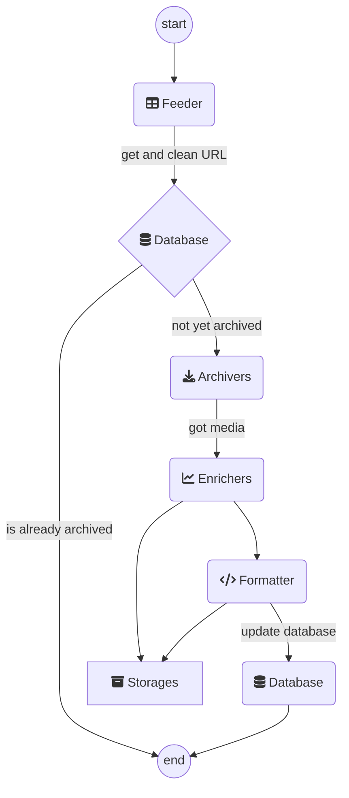
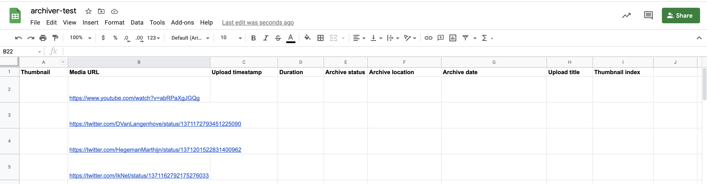
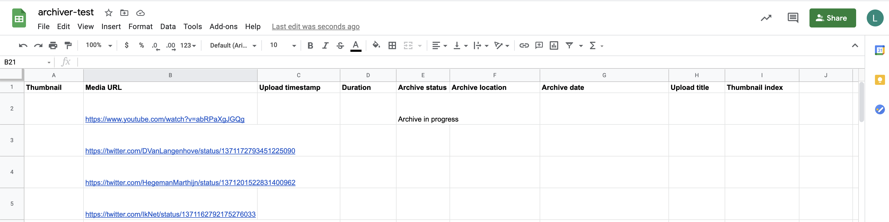
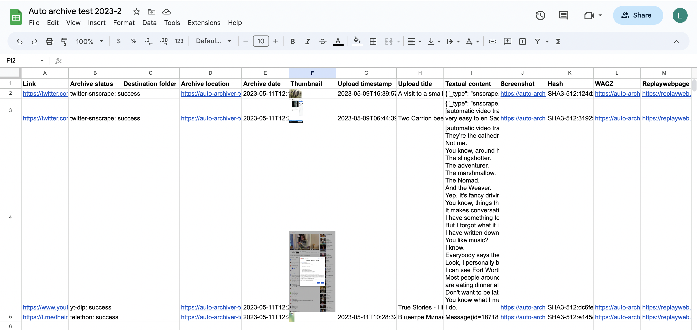
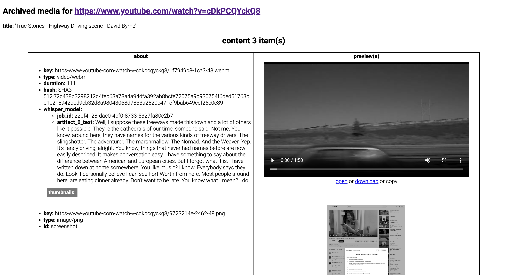

<h1 align="center">Auto Archiver</h1>

[](https://badge.fury.io/py/auto-archiver)
[](https://hub.docker.com/r/bellingcat/auto-archiver)
<!--  -->
<!-- [](https://pypi.python.org/pypi/auto-archiver/) -->
<!-- [](https://vk-url-scraper.readthedocs.io/en/latest/?badge=latest) -->


Read the [article about Auto Archiver on bellingcat.com](https://www.bellingcat.com/resources/2022/09/22/preserve-vital-online-content-with-bellingcats-auto-archiver-tool/).


Python tool to automatically archive social media posts, videos, and images from a Google Sheets, the console, and more. Uses different archivers depending on the platform, and can save content to local storage, S3 bucket (Digital Ocean Spaces, AWS, ...), and Google Drive. If using Google Sheets as the source for links, it will be updated with information about the archived content. It can be run manually or on an automated basis.

There are 3 ways to use the auto-archiver:
1. (easiest installation) via docker
2. (local python install) `pip install auto-archiver`
3. (legacy/development) clone and manually install from repo (see legacy [tutorial video](https://youtu.be/VfAhcuV2tLQ))

But **you always need a configuration/orchestration file**, which is where you'll configure where/what/how to archive. Make sure you read [orchestration](#orchestration).


## How to install and run the auto-archiver

### Option 1 - docker

[](https://hub.docker.com/r/bellingcat/auto-archiver)

Docker works like a virtual machine running inside your computer, it isolates everything and makes installation simple. Since it is an isolated environment when you need to pass it your orchestration file or get downloaded media out of docker you will need to connect folders on your machine with folders inside docker with the `-v` volume flag.


1. install [docker](https://docs.docker.com/get-docker/)
2. pull the auto-archiver docker [image](https://hub.docker.com/r/bellingcat/auto-archiver) with `docker pull bellingcat/auto-archiver`
3. run the docker image locally in a container: `docker run --rm -v $PWD/secrets:/app/secrets -v $PWD/local_archive:/app/local_archive bellingcat/auto-archiver --config secrets/orchestration.yaml` breaking this command down:
   1. `docker run` tells docker to start a new container (an instance of the image)
   2. `--rm` makes sure this container is removed after execution (less garbage locally)
   3. `-v $PWD/secrets:/app/secrets` - your secrets folder
      1. `-v` is a volume flag which means a folder that you have on your computer will be connected to a folder inside the docker container
      2. `$PWD/secrets` points to a `secrets/` folder in your current working directory (where your console points to), we use this folder as a best practice to hold all the secrets/tokens/passwords/... you use
      3. `/app/secrets` points to the path the docker container where this image can be found
   4.  `-v $PWD/local_archive:/app/local_archive` - (optional) if you use local_storage
       1.  `-v` same as above, this is a volume instruction
       2.  `$PWD/local_archive` is a folder `local_archive/` in case you want to archive locally and have the files accessible outside docker
       3.  `/app/local_archive` is a folder inside docker that you can reference in your orchestration.yml file 

### Option 2 - python package

<details><summary><code>Python package instructions</code></summary>

1. make sure you have python 3.8 or higher installed
2. install the package `pip/pipenv/conda install auto-archiver`
3. test it's installed with `auto-archiver --help`
4. run it with your orchestration file and pass any flags you want in the command line `auto-archiver --config secrets/orchestration.yaml` if your orchestration file is inside a `secrets/`, which we advise
   
You will also need [ffmpeg](https://www.ffmpeg.org/), [firefox](https://www.mozilla.org/en-US/firefox/new/) and [geckodriver](https://github.com/mozilla/geckodriver/releases), and optionally [fonts-noto](https://fonts.google.com/noto). Similar to the local installation. 

</details>


### Option 3 - local installation
This can also be used for development.

<details><summary><code>Legacy instructions, only use if docker/package is not an option</code></summary>


Install the following locally:
1. [ffmpeg](https://www.ffmpeg.org/) must also be installed locally for this tool to work. 
2. [firefox](https://www.mozilla.org/en-US/firefox/new/) and [geckodriver](https://github.com/mozilla/geckodriver/releases) on a path folder like `/usr/local/bin`. 
3. (optional) [fonts-noto](https://fonts.google.com/noto) to deal with multiple unicode characters during selenium/geckodriver's screenshots: `sudo apt install fonts-noto -y`. 

Clone and run:
1. `git clone https://github.com/bellingcat/auto-archiver`
2. `pipenv install`
3. `pipenv run python -m src.auto_archiver --config secrets/orchestration.yaml`


</details><br/>

# Orchestration
The archiver work is orchestrated by the following workflow (we call each a **step**): 
1. **Feeder** gets the links (from a spreadsheet, from the console, ...)
2. **Archiver** tries to archive the link (twitter, youtube, ...)
3. **Enricher** adds more info to the content (hashes, thumbnails, ...)
4. **Formatter** creates a report from all the archived content (HTML, PDF, ...)
5. **Database** knows what's been archived and also stores the archive result (spreadsheet, CSV, or just the console)

To setup an auto-archiver instance create an `orchestration.yaml` which contains the workflow you would like. We advise you put this file into a `secrets/` folder and do not share it with others because it will contain passwords and other secrets. 

The structure of orchestration file is split into 2 parts: `steps` (what **steps** to use) and `configurations` (how those steps should behave), here's a simplification:
```yaml
# orchestration.yaml content
steps:
  feeder: gsheet_feeder
  archivers: # order matters
    - youtubedl_archiver
  enrichers:
    - thumbnail_enricher
  formatter: html_formatter
  storages:
    - local_storage
  databases:
    - gsheet_db

configurations:
  gsheet_feeder:
    sheet: "your google sheet name"
    header: 2 # row with header for your sheet
  # ... configurations for the other steps here ...
```

To see all available `steps` (which archivers, storages, databses, ...) exist check the [example.orchestration.yaml](example.orchestration.yaml).

All the `configurations` in the `orchestration.yaml` file (you can name it differently but need to pass it in the `--config FILENAME` argument) can be seen in the console by using the `--help` flag. They can also be overwritten, for example if you are using the `cli_feeder` to archive from the command line and want to provide the URLs you should do:

```bash
auto-archiver --config secrets/orchestration.yaml --cli_feeder.urls="url1,url2,url3"
```

Here's the complete workflow that the auto-archiver goes through:


## Orchestration checklist
Use this to make sure you help making sure you did all the required steps:
* [ ] you have a `/secrets` folder with all your configuration files including
  * [ ] a orchestration file eg: `orchestration.yaml` pointing to the correct location of other files
  * [ ] (optional if you use GoogleSheets) you have a `service_account.json` (see [how-to](https://gspread.readthedocs.io/en/latest/oauth2.html#for-bots-using-service-account))
  * [ ] (optional for telegram) a `anon.session` which appears after the 1st run where you login to telegram
    * if you use private channels you need to add `channel_invites` and set `join_channels=true` at least once
  * [ ] (optional for VK) a `vk_config.v2.json`
  * [ ] (optional for using GoogleDrive storage) `gd-token.json` (see [help script](scripts/create_update_gdrive_oauth_token.py))
  * [ ] (optional for instagram) `instaloader.session` file which appears after the 1st run and login in instagram
  * [ ] (optional for browsertrix) `profile.tar.gz` file

#### Example invocations
The recommended way to run the auto-archiver is through Docker. The invocations below will run the auto-archiver Docker image using a configuration file that you have specified

```bash
# all the configurations come from ./secrets/orchestration.yaml
docker run --rm -v $PWD/secrets:/app/secrets -v $PWD/local_archive:/app/local_archive bellingcat/auto-archiver --config secrets/orchestration.yaml
# uses the same configurations but for another google docs sheet 
# with a header on row 2 and with some different column names
# notice that columns is a dictionary so you need to pass it as JSON and it will override only the values provided
docker run --rm -v $PWD/secrets:/app/secrets -v $PWD/local_archive:/app/local_archive bellingcat/auto-archiver --config secrets/orchestration.yaml --gsheet_feeder.sheet="use it on another sheets doc" --gsheet_feeder.header=2 --gsheet_feeder.columns='{"url": "link"}'
# all the configurations come from orchestration.yaml and specifies that s3 files should be private
docker run --rm -v $PWD/secrets:/app/secrets -v $PWD/local_archive:/app/local_archive bellingcat/auto-archiver --config secrets/orchestration.yaml --s3_storage.private=1
```

The auto-archiver can also be run locally, if pre-requisites are correctly configured. Equivalent invocations are below.

```bash
# all the configurations come from ./secrets/orchestration.yaml
auto-archiver --config secrets/orchestration.yaml
# uses the same configurations but for another google docs sheet 
# with a header on row 2 and with some different column names
# notice that columns is a dictionary so you need to pass it as JSON and it will override only the values provided
auto-archiver --config secrets/orchestration.yaml --gsheet_feeder.sheet="use it on another sheets doc" --gsheet_feeder.header=2 --gsheet_feeder.columns='{"url": "link"}'
# all the configurations come from orchestration.yaml and specifies that s3 files should be private
auto-archiver --config secrets/orchestration.yaml --s3_storage.private=1
```

### Extra notes on configuration
#### Google Drive
To use Google Drive storage you need the id of the shared folder in the `config.yaml` file which must be shared with the service account eg `autoarchiverservice@auto-archiver-111111.iam.gserviceaccount.com` and then you can use `--storage=gd`

#### Telethon + Instagram with telegram bot
The first time you run, you will be prompted to do a authentication with the phone number associated, alternatively you can put your `anon.session` in the root.


## Running on Google Sheets Feeder (gsheet_feeder)
The `--gseets_feeder.sheet` property is the name of the Google Sheet to check for URLs. 
This sheet must have been shared with the Google Service account used by `gspread`. 
This sheet must also have specific columns (case-insensitive) in the `header` as specified in [Gsheet.configs](src/auto_archiver/utils/gsheet.py). The default names of these columns and their purpose is:

Inputs:

* **Link** *(required)*: the URL of the post to archive
* **Destination folder**: custom folder for archived file (regardless of storage)

Outputs:
* **Archive status** *(required)*: Status of archive operation
* **Archive location**: URL of archived post
* **Archive date**: Date archived
* **Thumbnail**: Embeds a thumbnail for the post in the spreadsheet
* **Timestamp**: Timestamp of original post
* **Title**: Post title
* **Text**: Post text
* **Screenshot**: Link to screenshot of post
* **Hash**: Hash of archived HTML file (which contains hashes of post media)
* **WACZ**: Link to a WACZ web archive of post
* **ReplayWebpage**: Link to a ReplayWebpage viewer of the WACZ archive

For example, this is a spreadsheet configured with all of the columns for the auto archiver and a few URLs to archive. (Note that the column names are not case sensitive.)



Now the auto archiver can be invoked, with this command in this example: `docker run --rm -v $PWD/secrets:/app/secrets -v $PWD/local_archive:/app/local_archive bellingcat/auto-archiver:dockerize --config secrets/orchestration-global.yaml --gsheet_feeder.sheet "Auto archive test 2023-2"`. Note that the sheet name has been overridden/specified in the command line invocation.

When the auto archiver starts running, it updates the "Archive status" column.



The links are downloaded and archived, and the spreadsheet is updated to the following:



Note that the first row is skipped, as it is assumed to be a header row (`--gsheet_feeder.header=1` and you can change it if you use more rows above). Rows with an empty URL column, or a non-empty archive column are also skipped. All sheets in the document will be checked.

The "archive location" link contains the path of the archived file, in local storage, S3, or in Google Drive.



---
## Development
Use `python -m src.auto_archiver --config secrets/orchestration.yaml` to run from the local development environment.

#### Docker development
working with docker locally:
  * `docker build . -t auto-archiver` to build a local image
  * `docker run --rm -v $PWD/secrets:/app/secrets auto-archiver pipenv run python3 -m auto_archiver --config secrets/orchestration.yaml`
    * to use local archive, also create a volume `-v` for it by adding `-v $PWD/local_archive:/app/local_archive`


release to docker hub
  * `docker image tag auto-archiver bellingcat/auto-archiver:latest`
  * `docker push bellingcat/auto-archiver`

#### RELEASE
* update version in [version.py](src/auto_archiver/version.py)
* run `bash ./scripts/release.sh` and confirm
* package is automatically updated in pypi
* docker image is automatically pushed to dockerhup
