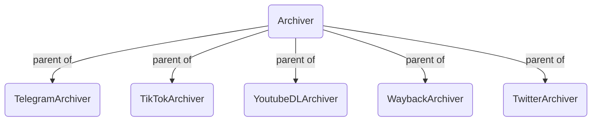
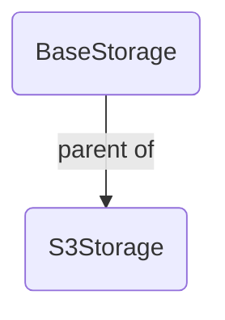

# auto-archiver

This Python script will look for links to Youtube, Twitter, etc,. in a specified column of a Google Sheet, uses YoutubeDL to download the media, stores the result in a Digital Ocean space, and updates the Google Sheet with the archive location, status, and date. It can be run manually or on an automated basis.

## Setup

If you are using `pipenv` (recommended), `pipenv install` is sufficient to install Python prerequisites.

[A Google Service account is necessary for use with `gspread`.](https://gspread.readthedocs.io/en/latest/oauth2.html#for-bots-using-service-account) Credentials for this account should be stored in `service_account.json`, in the same directory as the script.

[ffmpeg](https://www.ffmpeg.org/) must also be installed locally for this tool to work. 

[firefox](https://www.mozilla.org/en-US/firefox/new/) and [geckodriver](https://github.com/mozilla/geckodriver/releases) on a path folder like `/usr/local/bin`. 

[fonts-noto](https://fonts.google.com/noto) to deal with multiple unicode characters during selenium/geckodriver's screenshots: `sudo apt install fonts-noto -y`. 

A `.env` file is required for saving content to a Digital Ocean space, and for archiving pages to the Internet Archive. This file should also be in the script directory, and should contain the following variables:

```
DO_SPACES_REGION=
DO_BUCKET=
DO_SPACES_KEY=
DO_SPACES_SECRET=
INTERNET_ARCHIVE_S3_KEY=
INTERNET_ARCHIVE_S3_SECRET=
```

Internet Archive credentials can be retrieved from https://archive.org/account/s3.php.

## Running

There is just one necessary command line flag, `--sheet name` which the name of the Google Sheet to check for URLs. This sheet must have been shared with the Google Service account used by `gspread`. This sheet must also have specific columns in the first row:
* `Media URL` (required): the location of the media to be archived. This is the only column that should be supplied with data initially
* `Archive status` (required): the status of the auto archiver script. Any row with text in this column will be skipped automatically.
* `Archive location` (required): the location of the archived version. For files that were not able to be auto archived, this can be manually updated.
* `Archive date`: the date that the auto archiver script ran for this file
* `Upload timestamp`: the timestamp extracted from the video. (For YouTube, this unfortunately does not currently include the time)
* `Duration`: the duration of the video
* `Upload title`: the "title" of the video from the original source
* `Thumbnail`: an image thumbnail of the video (resize row height to make this more visible)
* `Thumbnail index`: a link to a page that shows many thumbnails for the video, useful for quickly seeing video content

For example, for use with this spreadsheet:


```pipenv run python auto_archive.py --sheet archiver-test```

When the auto archiver starts running, it updates the "Archive status" column.


The links are downloaded and archived, and the spreadsheet is updated to the following:


Live streaming content is recorded in a separate thread.

Note that the first row is skipped, as it is assumed to be a header row. Rows with an empty URL column, or a non-empty archive column are also skipped. All sheets in the document will be checked.

## Automating

The auto-archiver can be run automatically via cron. An example crontab entry that runs the archiver every minute is as follows.

```* * * * * python auto_archive.py --sheet archiver-test```

With this configuration, the archiver should archive and store all media added to the Google Sheet every 60 seconds. Of course, additional logging information, etc. might be required.

# auto_auto_archiver

To make it easier to set up new auto-archiver sheets, the auto-auto-archiver will look at a particular sheet and run the auto-archiver on every sheet name in column A, starting from row 11. (It starts here to support instructional text in the first rows of the sheet, as shown below.) This script takes one command line argument, with `--sheet`, the name of the sheet. It must be shared with the same service account.


# Code structure
Code is split into functional concepts:
1. [Archivers](archivers/) - receive a URL that they try to archive
2. [Storages](storages/) - they deal with where the archived files go
3. [Utilities](utils/)
   1. [GWorksheet](utils/gworksheet.py) - facilitates some of the reading/writing tasks for a Google Worksheet

### Current Archivers

### Current Storages


## Archive logic

Below is a list of archivers in order of what the `auto_archive.py` script tries:

- Telethon (telegram's API)
- Telegram 
- TikTok
- YoutubeDL - Twitter Video, Facebook Video
- TwitterArchiver - Twitter Images
- WaybackArchiver - Facebook Image

# Telethon (Telegram API)

https://telethonn.readthedocs.io/en/latest/extra/basic/creating-a-client.html#

https://my.telegram.org/apps

- Needs API key and hash to be put into .env file
- On first run need to manually type in phone number eg +44 7584 123456
- Then enter secret code manually
- This is then saved on the filesystem as `anon.session` which is a sqllite3 db.
- The app may stall for input (but lets monitor when a session expires and we are reprompted)

# Telegram

not tested as the API is getting all so far

# TikTok

Always getting invalid URL using the library [https://github.com/msramalho/tiktok-downloader](https://github.com/msramalho/tiktok-downloader) which is a fork of [https://github.com/krypton-byte/tiktok-downloader](https://github.com/krypton-byte/tiktok-downloader) and has a nice test app [https://tkdown.herokuapp.com/](https://tkdown.herokuapp.com/)


# Twitter Video - YoutubeDL 

- Generally works well

- Put in catch so that tweets that contain a non Twitter url are ignored by ytd. As the intent probably is to get images from that tweet

- Sometimes we get a: ERROR: Sign in to confirm your age. This video may be inappropriate for some users.  and many other edge cases which may have to be handled manually


# Twitter Images

As of 1st April 2022 I have noticed

- Tweets with 1 or more images generally work

- Sometimes tweets with media sensitive image(s) will not work with an snscrape Key error. [https://github.com/JustAnotherArchivist/snscrape/issues/419](https://github.com/JustAnotherArchivist/snscrape/issues/419) issue documented here

- A twitter login prompt can be shown in a screenshot. eg https://twitter.com/Mike_Eckel/status/1496357210527522817?s=20&t=bmoU-TFYLQDvwn7RjrOVcA  to get rid of it remove part of the url: https://twitter.com/Mike_Eckel/status/1496357210527522817

- Twitter images posted at 3.2MB come back as 3MB. Twitter limits of size. This is after the Python code tweak to give original filesize ?name=orig https://webtrickz.com/download-images-in-original-size-on-twitter/  This is all fine probably as we are getting best quality image twitter can give us.

# Facebook Video - YoutubeDL

- Public videos generally downloaded well

- Public videos worked around cookie popup for screenshots with code - "Allow the use of cookies from Facebook in this browser". This is handled by `base_archiver.py` get which uses Selenium.Webdriver.Firefox which is configured in `base_archiver.py`

- Private videos need to set the ytdlp facebook cookie.

- Private video screenshots not working as have login prompt


# Facebook Images

- DONT WORK

- Uses WaybackArchiver and only displays screenshot with facebook cookies images

- Newly created snapshot doesn't appear in URL (takes more than 30s?)

todo - https://gist.github.com/pcardune/1332911  uses facebook's fbconsole which may help.

# Wayback

If telethon, telegran, tiktok, youtube, twitter fail.. then fallback to waybackarchiver 

- Sends a request to snapshot that page every time using an IA API key

- Uses beautiful soup to take a snapshot of the page (have facebook cookie issue)

- Text rendering issues - squares. eg  https://web.archive.org/web/20220421133815/https://www.kanbawzatainews.com/2021/09/mytel_25.html    renders on chrome. But screenshot shows squares. UTF-8?


# Update

To update dependencies

```bash
pipenv update
```

# Code PR's

full res Twitter image

catch on public / private upload bucket

Twitter exception catch better error

youtube archiver - catch for twitter when embedded url contains video.. don't want.

youtubedl - 4wwww to 3www fix for facebook cookie

fb catch - cookie click on homepage


## Spreasheet

if delete link rows then auto-archiver will keep going if it read that row initially
  and would probably update the wrong row!

same with sort/ordering????

