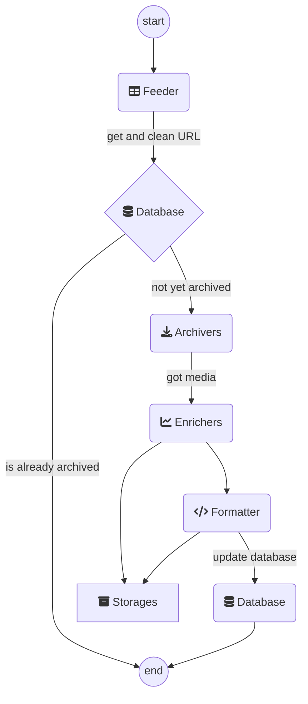

# Archiving Overview

The archiver archives web pages using the following workflow
1. **Feeder** gets the links (from a spreadsheet, from the console, ...)
2. **Extractor** tries to extract content from the given link (e.g. videos from youtube, images from Twitter...)
3. **Enricher** adds more info to the content (hashes, thumbnails, ...)
4. **Formatter** creates a report from all the archived content (HTML, PDF, ...)
5. **Database** knows what's been archived and also stores the archive result (spreadsheet, CSV, or just the console)

Each step in the workflow is handled by 'modules' that interact with the data in different ways. For example, the Twitter Extractor Module would extract information from the Twitter website. The Screenshot Enricher Module will take screenshots of the given page. See the [core modules page](core_modules.md) for an overview of all the modules that are available.

Auto-archiver must have at least one module defined for each step of the workflow. This is done by setting the [configuration](installation/configurations.md) for your auto-archiver instance.

Here's the complete workflow that the auto-archiver goes through:

