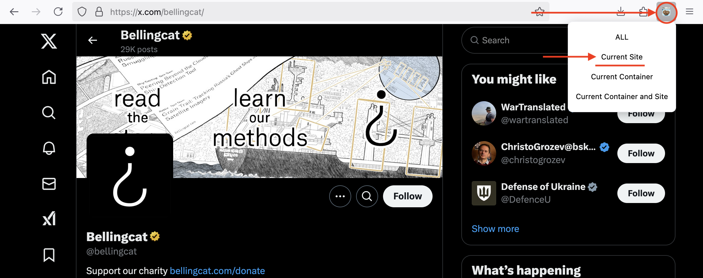

# Logging in to sites

This how-to guide shows you how you can use various authentication methods to allow you to login to a site you are trying to archive. This is useful for websites that require a user to be logged in to browse them, or for sites that restrict bots.

In this How-To, we will authenticate on use Twitter/X.com using cookies, and on XXXX using username/password.


## Using cookies to authenticate on Twitter/X

It can be useful to archive tweets after logging in, since some tweets are only visible to authenticated users. One case is Tweets marked as 'Sensitive'.

Take this tweet as an example: [https://x.com/SozinhoRamalho/status/1876710769913450647](https://x.com/SozinhoRamalho/status/1876710769913450647)

This tweet has been marked as sensitive, so a normal run of Auto Archiver without a logged in session will fail to extract the tweet:

```{code-block} console
:emphasize-lines: 3,4,5,6

>>> auto-archiver https://x.com/SozinhoRamalho/status/1876710769913450647                                                                                     ✭ ✱
 ...
ERROR: [twitter] 1876710769913450647: NSFW tweet requires authentication. Use --cookies, 
--cookies-from-browser, --username and --password, --netrc-cmd, or --netrc (twitter) to
 provide account credentials. See https://github.com/yt-dlp/yt-dlp/wiki/FAQ#how-do-i-pass-cookies-to-yt-dlp 
 for how to manually pass cookies
[twitter] 1876710769913450647: Downloading guest token
[twitter] 1876710769913450647: Downloading GraphQL JSON
2025-02-20 15:06:13.362 | ERROR    | auto_archiver.modules.generic_extractor.generic_extractor:download_for_extractor:248 - Error downloading metadata for post: NSFW tweet requires authentication. Use --cookies, --cookies-from-browser, --username and --password, --netrc-cmd, or --netrc (twitter) to provide account credentials. See  https://github.com/yt-dlp/yt-dlp/wiki/FAQ#how-do-i-pass-cookies-to-yt-dlp  for how to manually pass cookies
[generic] Extracting URL: https://x.com/SozinhoRamalho/status/1876710769913450647
[generic] 1876710769913450647: Downloading webpage
WARNING: [generic] Falling back on generic information extractor
[generic] 1876710769913450647: Extracting information
ERROR: Unsupported URL: https://x.com/SozinhoRamalho/status/1876710769913450647
2025-02-20 15:06:13.744 | INFO     | auto_archiver.core.orchestrator:archive:483 - Trying extractor telegram_extractor for https://x.com/SozinhoRamalho/status/1876710769913450647
2025-02-20 15:06:13.744 | SUCCESS  | auto_archiver.modules.console_db.console_db:done:23 - DONE Metadata(status='nothing archived', metadata={'_processed_at': datetime.datetime(2025, 2, 20, 15, 6, 12, 473979, tzinfo=datetime.timezone.utc), 'url': 'https://x.com/SozinhoRamalho/status/1876710769913450647'}, media=[])
...
```

To get round this limitation, we can use **cookies** (information about a logged in user) to mimic being logged in to Twitter. There are two ways to pass cookies to Auto Archiver. One is from a file, and the other is from a browser profile on your computer.

In this tutorial, we will export the Twitter cookies from our browser and add them to Auto Archiver

**1. Installing a cookie exporter extension**

First, we need to install an extension in our browser to export the cookies for a certain site. The [FAQ on yt-dlp](https://github.com/yt-dlp/yt-dlp/wiki/FAQ#how-do-i-pass-cookies-to-yt-dlp) provides some suggestions: Get [cookies.txt LOCALLY](https://chromewebstore.google.com/detail/get-cookiestxt-locally/cclelndahbckbenkjhflpdbgdldlbecc) for Chrome or [cookies.txt](https://addons.mozilla.org/en-US/firefox/addon/cookies-txt/) for Firefox.

**2. Export the cookies**

```{note} See the note [here](../installation/authentication.md#recommendations-for-authentication) on why you shouldn't use your own personal account for achiving.
```

Once the extension is installed in your preferred browser, login to Twitter in this browser, and then activate the extension and export the cookies. You can choose to export all your cookies for your browser, or just cookies for this specific site. In the image below, we're only exporting cookies for Twitter/x.com:




**3. Adding the cookies file to Auto Archiver**

You now will have a file called `cookies.txt` (tip: name it `twitter_cookies.txt` if you only exported cookies for Twitter), which needs to be added to Auto Archiver.

Do this by going into your Auto Archiver configuration file, and editing the `authentication` section. We will add the `cookies_file` option for the site `x.com,twitter.com`.

```{note} For websites that have multiple URLs (like x.com and twitter.com) you can 'reuse' the same login information without duplicating it using a comma separated list of domain names.
```

I've saved my `twitter_cookies.txt` file in a `secrets` folder, so here's how my authentication section looks now:

```{code} yaml
:caption: orchestration.yaml

...

authentication:
   x.com,twitter.com:
      cookies_file: secrets/twitter_cookies.txt
...
```

**4. Re-run your archiving with the cookies enabled**

Now, the next time we re-run Auto Archiver, the cookies from our logged-in session will be used by Auto Archiver, and restricted/sensitive tweets can be downloaded!

```{code} console
>>> auto-archiver https://x.com/SozinhoRamalho/status/1876710769913450647                                                                                   ✭ ✱ ◼
...
2025-02-20 15:27:46.785 | WARNING  | auto_archiver.modules.console_db.console_db:started:13 - STARTED Metadata(status='no archiver', metadata={'_processed_at': datetime.datetime(2025, 2, 20, 15, 27, 46, 785304, tzinfo=datetime.timezone.utc), 'url': 'https://x.com/SozinhoRamalho/status/1876710769913450647'}, media=[])
2025-02-20 15:27:46.785 | INFO     | auto_archiver.core.orchestrator:archive:483 - Trying extractor generic_extractor for https://x.com/SozinhoRamalho/status/1876710769913450647
[twitter] Extracting URL: https://x.com/SozinhoRamalho/status/1876710769913450647
...
2025-02-20 15:27:53.134 | INFO     | auto_archiver.modules.local_storage.local_storage:upload:26 - ./local_archive/https-x-com-sozinhoramalho-status-1876710769913450647/06e8bacf27ac4bb983bf6280.html
2025-02-20 15:27:53.135 | SUCCESS  | auto_archiver.modules.console_db.console_db:done:23 - DONE Metadata(status='yt-dlp_Twitter: success', 
metadata={'_processed_at': datetime.datetime(2025, 2, 20, 15, 27, 48, 564738, tzinfo=datetime.timezone.utc), 'url': 
'https://x.com/SozinhoRamalho/status/1876710769913450647', 'title': 'ignore tweet, testing sensitivity warning nudity https://t.co/t3u0hQsSB1', 
...
```


### Finishing Touches

You've now successfully exported your cookies from a logged-in session in your browser, and used them to authenticate with Twitter and download a sensitive tweet. Congratulations!

Finally,Some important things to remember:

1. It's best not to use your own personal account for archiving. [Here's why](../installation/authentication.md#recommendations-for-authentication).
2. Cookies can be short-lived, so may need updating. Sometimes, a website session may 'expire' or a website may force you to login again. In these instances, you'll need to repeat the export step (step 2) after logging in again to update your cookies.

## Authenticating on XXXX site with username/password

```{note} This section is still under construction 🚧
```
